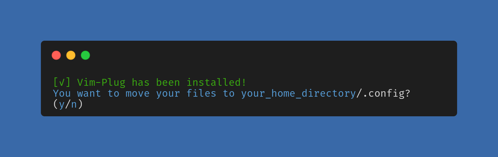

<h1 align="center">Neovim config</h1>

> A simple configuration for neovim that I use.

## 💻 Prerequisites
This is required to use and setup this neovim configuration.
* __wget__ - To install vim-plug
* __nodejs__ - Used by coc.nvim(coc.mvim is used to intelisense and code completion )

## 🚀 Installing and Configuring 
Install configuration in your home directory using:
```
$ git clone https://github.com/sennshi/neovim-config
```
after, to setup, run file `install.sh`(this file install vim-plug and move the config):
```
$ chmod +x install.sh
$ ./install.sh
```

or execute:

```
$ bash install.sh
```
After running the file, in your terminal you will see this



## ⌨️ Mappings

| Key                  | Action                       |
|----------------------|------------------------------|
| Space                | **<leader>** key             |
| jk                   | Change mode in insert mode   |
| **leader**sv         | Reload luafile               |
| **leader**a          | Select all lines on the file |
| Ctrl-q               | Quit file                    |
| Ctrl-s               | Save file                    |
| Ctrl-w               | Save and quit file           |
| Ctrl-o               | Open NERDTree                |
| **leader**. or Alt-. | Next buffer                  |
| **leader**, or Alt-, | Previous buffer              |
| Alt-f                | Move buffer to left          |
| Alt-j                | Move buffer to right         |
| Ctrl-l               | Fix and unfix buffer         |
| Alt-d                | Close buffer by letter       |
| Ctrl-k               | Coc.nvim confirm suggestion  |
| Ctrl-n               | Select bottom suggestions    |
| Ctrl-p               | Select top suggestions       |

[⬆ Go to the top](#nome-do-projeto)<br>
